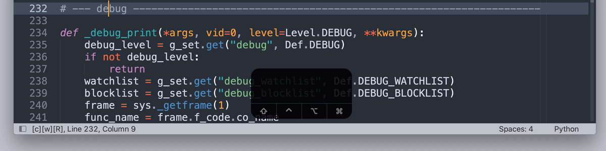

# Exact Quick Find

> A Sublime Text plugin that implements quick-find aware of case-sensitive / whole-word / wrap-scan flags.



*^ Quick-finding the exact whole word `"debug"` in lowercase.*

Note that non-matches such as `_debug_print` and `DEBUG` are not qualified and have been skipped.

Also note that the flags on the status bar are toggled to `[C][W][R]`.

`[C]` for case sensitive. `[W]` for whole word. `[R]` for wrap scan.

## Install

[Package Control](https://packagecontrol.io/packages/Exact%20Quick%20Find)

## How to Use

### 1. Key Bindings

No default key bindings. Define your own. For recommended key bindings, open

```
Preferences > Package Settings > Exact Quick Find > Key Bindings
```

or enter in the command palette

```
Preferences: Exact Quick Find Key Bindings
```

#### Recommended Key Bindings

##### Basic Commands

| Command                                   | Windows / Linux                                   | macOS                                            |
| ----------------------------------------- | ------------------------------------------------- | ------------------------------------------------ |
| Exact Quick Find: Goto Next               | <kbd>Ctrl</kbd> + <kbd>E</kbd>                    | <kbd>Cmd</kbd> + <kbd>E</kbd>                    |
| Exact Quick Find: Goto Prev               | <kbd>Ctrl</kbd> + <kbd>B</kbd>                    | <kbd>Cmd</kbd> + <kbd>B</kbd>                    |
| Exact Quick Find: Goto Prev               | <kbd>Ctrl</kbd> + <kbd>Shift</kbd> + <kbd>E</kbd> | <kbd>Cmd</kbd> + <kbd>Shift</kbd> + <kbd>E</kbd> |
| Exact Quick Find: Add Next                | <kbd>Ctrl</kbd> + <kbd>D</kbd>                    | <kbd>Cmd</kbd> + <kbd>D</kbd>                    |
| Exact Quick Find: Add Prev                | <kbd>Ctrl</kbd> + <kbd>Shift</kbd> + <kbd>D</kbd> | <kbd>Cmd</kbd> + <kbd>Shift</kbd> + <kbd>D</kbd> |
| Exact Quick Find: Add All                 | <kbd>Ctrl</kbd> + <kbd>Alt</kbd> + <kbd>D</kbd>   | <kbd>Cmd</kbd> + <kbd>Opt</kbd> + <kbd>D</kbd>   |
| Exact Quick Find: Toggle `Case Sensitive` | <kbd>Alt</kbd> + <kbd>C</kbd>                     | <kbd>Opt</kbd> + <kbd>C</kbd>                    |
| Exact Quick Find: Toggle `Whole Word`     | <kbd>Alt</kbd> + <kbd>W</kbd>                     | <kbd>Opt</kbd> + <kbd>W</kbd>                    |
| Exact Quick Find: Toggle `Wrap Scan`      | <kbd>Alt</kbd> + <kbd>R</kbd>                     | <kbd>Opt</kbd> + <kbd>R</kbd>                    |
| Exact Quick Find: Flip Find Flags         | <kbd>Alt</kbd> + <kbd>F</kbd>                     | <kbd>Opt</kbd> + <kbd>F</kbd>                    |

##### Advanced Commands

| Command                              | Windows / Linux                                   | macOS                                            |
| ------------------------------------ | ------------------------------------------------- | ------------------------------------------------ |
| Exact Quick Find: Peek Next          | <kbd>Ctrl</kbd> + <kbd>G</kbd>                    | <kbd>Cmd</kbd> + <kbd>G</kbd>                    |
| Exact Quick Find: Peek Prev          | <kbd>Ctrl</kbd> + <kbd>Shift</kbd> + <kbd>G</kbd> | <kbd>Cmd</kbd> + <kbd>Shift</kbd> + <kbd>G</kbd> |
| Exact Quick Find: Peek Next Selected | <kbd>Ctrl</kbd> + <kbd>H</kbd>                    | <kbd>Cmd</kbd> + <kbd>H</kbd>                    |
| Exact Quick Find: Peek Prev Selected | <kbd>Ctrl</kbd> + <kbd>Shift</kbd> + <kbd>H</kbd> | <kbd>Cmd</kbd> + <kbd>Shift</kbd> + <kbd>H</kbd> |
| Exact Quick Find: Add This           | <kbd>Ctrl</kbd> + <kbd>6</kbd>                    | <kbd>Cmd</kbd> + <kbd>6</kbd>                    |
| Exact Quick Find: Subtract This      | <kbd>Ctrl</kbd> + <kbd>Shift</kbd> + <kbd>6</kbd> | <kbd>Cmd</kbd> + <kbd>Shift</kbd> + <kbd>6</kbd> |
| Exact Quick Find: Single Select This | <kbd>Ctrl</kbd> + <kbd>7</kbd>                    | <kbd>Cmd</kbd> + <kbd>7</kbd>                    |
| Exact Quick Find: Invert Select This | <kbd>Ctrl</kbd> + <kbd>Shift</kbd> + <kbd>7</kbd> | <kbd>Cmd</kbd> + <kbd>Shift</kbd> + <kbd>7</kbd> |
| Exact Quick Find: Go First           | <kbd>Ctrl</kbd> + <kbd>5</kbd>                    | <kbd>Cmd</kbd> + <kbd>5</kbd>                    |
| Exact Quick Find: Go Last            | <kbd>Ctrl</kbd> + <kbd>Shift</kbd> + <kbd>5</kbd> | <kbd>Cmd</kbd> + <kbd>Shift</kbd> + <kbd>5</kbd> |
| Exact Quick Find: Go Back            | <kbd>Ctrl</kbd> + <kbd>8</kbd>                    | <kbd>Cmd</kbd> + <kbd>8</kbd>                    |

### 2. Main Menu

```
Find > Exact Quick Find > Goto Next
Find > Exact Quick Find > Goto Prev
Find > Exact Quick Find > Add Next
Find > Exact Quick Find > Add Prev
Find > Exact Quick Find > Add All
Find > Exact Quick Find > Peek Next
Find > Exact Quick Find > Peek Prev
Find > Exact Quick Find > Peek Next Selected
Find > Exact Quick Find > Peek Prev Selected
Find > Exact Quick Find > Add This
Find > Exact Quick Find > Subtract This
Find > Exact Quick Find > Single Select This
Find > Exact Quick Find > Go First
Find > Exact Quick Find > Go Last
Find > Exact Quick Find > Go Back
Find > Exact Quick Find > Toggle Case Sensitive
Find > Exact Quick Find > Toggle Whole Word
Find > Exact Quick Find > Toggle Wrap Scan
Find > Exact Quick Find > Flip Find Flags
```

### 3. Command Palette

```
Exact Quick Find: Goto Next
Exact Quick Find: Goto Prev
Exact Quick Find: Add Next
Exact Quick Find: Add Prev
Exact Quick Find: Add All
Exact Quick Find: Peek Next
Exact Quick Find: Peek Prev
Exact Quick Find: Peek Next Selected
Exact Quick Find: Peek Prev Selected
Exact Quick Find: Add This
Exact Quick Find: Subtract This
Exact Quick Find: Single Select This
Exact Quick Find: Go First
Exact Quick Find: Go Last
Exact Quick Find: Go Back
Exact Quick Find: Toggle Case Sensitive
Exact Quick Find: Toggle Whole Word
Exact Quick Find: Toggle Wrap Scan
Exact Quick Find: Flip Find Flags
```

*Hint: enter `eqf` in the command palette and all the commands will show up.*

## Settings

```
Preferences > Package Settings > Exact Quick Find > Settings
```

or enter in the command palette

```
Preferences: Exact Quick Find Settings
```

## Documentation

### Basic Commands: Finding Matches and Toggling Flags

- `Exact Quick Find: Goto Next` to go to the next match *- this is like the built-in `Quick Find Next`*

- `Exact Quick Find: Goto Prev` to go to the previous match

- `Exact Quick Find: Add Next` to add the next match  *- this is like the built-in `Quick Add Next`*

- `Exact Quick Find: Add Prev` to add the previous match

- `Exact Quick Find: Add All` to add all the matches  *- this is like the built-in `Quick Find All`*

- `Exact Quick Find: Toggle Case Sensitive` to toggle the case-sensitive flag

- `Exact Quick Find: Toggle Whole Word` to toggle the whole-word flag

- `Exact Quick Find: Toggle Wrap Scan` to toggle the wrap-scan flag

- `Exact Quick Find: Flip Find Flags` to toggle multiple flags in one go

### Advanced Commands: Editing Selections with Peek-Based Methods


*^ Adding, subtracting, and reviewing selections with peek-based methods.*

- `Exact Quick Find: Peek Next` to peek at the next match

- `Exact Quick Find: Peek Prev` to peek at the previous match

- `Exact Quick Find: Peek Next Selected` to peek at the next selected match

- `Exact Quick Find: Peek Prev Selected` to peek at the previous selected match

- `Exact Quick Find: Add This` to add the current match to selections

- `Exact Quick Find: Subtract This` to subtract the current match from selections

- `Exact Quick Find: Single Select This` to select only the current match

- `Exact Quick Find: Invert Select This` to select all the matches except the current one

- `Exact Quick Find: Go First` to go to / add / peek at the first match

- `Exact Quick Find: Go Last` to go to / add / peek at the last match

- `Exact Quick Find: Go Back` to go to / add / peek at the match where quick-find starts

### Understanding `Peek`

Among 3 different types of moves

1. `Goto` - leave the old region and move to a new region

2. `Add` - additionally select a new region

3. `Peek` - tentatively move to a new region without selecting it

`Peek` does ***not*** affect selections. You can first move to a region and then decide whether to select or de-select it.

### Understanding `Go`

How `Go` affects selections depends on its previous command

- If the previous command is `Goto`, to `Go` is to `Goto`

- If the previous command is `Add`, to `Go` is to `Add`

- If the previous command is `Peek`, to `Go` is to `Peek`

- If no previous commands, to `Go` is to `Goto`

## Author

Aaron Fu Lei

## License

MIT
